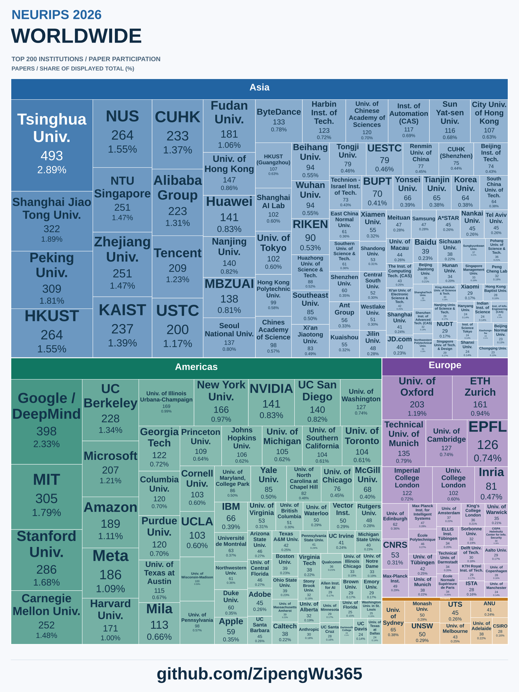

# NeurIPS 2026 Institution Atlas

English treemaps of institutional paper participation, with worldwide views and country editions for China, the United Kingdom, the United States, Germany, France, Italy, Australia, South Korea, India and Japan.

**[Open the interactive atlas](https://zipengwu365.github.io/neurips-institution-atlas/)** · **[UK edition](https://zipengwu365.github.io/neurips-institution-atlas/?view=united-kingdom)**

Created by [Zipeng Wu](https://zipengwu365.github.io/) · [GitHub profile](https://github.com/ZipengWu365)

Open `index.html` to explore all charts, search for institutions, change magnification and download SVG or CSV files. The page uses local assets without external JavaScript libraries. A searchable table lists every displayed institution with its full name; view and search state can be shared through the URL. The relative download links work when the project folder is kept together or hosted on GitHub Pages.

## First-listed-author edition

**[Explore first-listed-author institutions](https://zipengwu365.github.io/neurips-institution-atlas/first-author/)** · **[UK first-author edition](https://zipengwu365.github.io/neurips-institution-atlas/first-author/?view=united-kingdom)**

This separate edition preserves the canonical English institution labels in `NeurIPS_2026_First_Author_Institutions (1).xlsx`. Counts were reconstructed from distinct institution–paper pairs and checked against all 992 summary rows: 8,284 pairs from 8,129 of 9,006 source records. No additional aliases were merged. The workbook was processed on 29 September 2026; this is not a new conference snapshot date.

“First-listed author” is the first person in the source JSON author string, not PDF-verified first authorship or equal-contribution authorship. All explicit affiliations receive a full count. The 877 unrepresented records and incomplete geography limit coverage. The workbook reports 383 records missing affiliations, 524 containing unverified institution names and 69 author-string mismatches against newer public metadata; these categories overlap. Its track labels comprise 5,097 main-conference matches (a subset), 612 Evaluations and Datasets records, 46 Position Papers and 3,251 unconfirmed tracks. Charts combine these tracks and must not be presented as main-conference-only rankings.

Country assignments reuse the existing atlas conventions by exact or punctuation/accent-normalized name matches, plus [explicit overrides](first-author/data/geography_overrides.json). Of 992 labels, 793 are assigned and 199 remain unassigned. All global top-200 entries are assigned; national editions exclude unresolved entries and cannot be claimed exhaustive. China includes mainland China, Hong Kong, Macao and Taiwan.

| Country | Institutions shown |
|---|---:|
| China | 200 |
| United Kingdom | 45 |
| United States | 200 |
| Germany | 84 |
| France | 35 |
| Italy | 32 |
| Australia | 23 |
| South Korea | 51 |
| India | 19 |
| Japan | 37 |

[Full counts](first-author/data/institutions.csv) · [Source hash and coverage notes](first-author/data/source_notes.json) · [Institution–paper links](first-author/data/paper_links.json)

## Country editions (all-author participation)

| Country | Institutions displayed | Figure | Data |
|---|---:|---|---|
| China | 200 | [SVG](assets/china.svg) | [CSV](data/china.csv) |
| United Kingdom | 68 | [SVG](assets/united-kingdom.svg) | [CSV](data/united-kingdom.csv) |
| United States | 200 | [SVG](assets/united-states.svg) | [CSV](data/united-states.csv) |
| Germany | 118 | [SVG](assets/germany.svg) | [CSV](data/germany.csv) |
| France | 53 | [SVG](assets/france.svg) | [CSV](data/france.csv) |
| Italy | 42 | [SVG](assets/italy.svg) | [CSV](data/italy.csv) |
| Australia | 32 | [SVG](assets/australia.svg) | [CSV](data/australia.csv) |
| South Korea | 72 | [SVG](assets/south-korea.svg) | [CSV](data/south-korea.csv) |
| India | 40 | [SVG](assets/india.svg) | [CSV](data/india.csv) |
| Japan | 51 | [SVG](assets/japan.svg) | [CSV](data/japan.csv) |

The worldwide views show 200 institutions grouped [by region](assets/world-regions.svg) or [by country](assets/world-countries.svg). Country editions are selected from the full source table, not from the worldwide top 200.

## Counting and selection

### Percentages

Each rectangle shows the institution's paper count and its percentage of the total institution–paper counts displayed in that chart. For a global top-200 chart, the denominator is the sum across those 200 displayed institutions; for a country edition, it is the sum across the institutions displayed in that country edition (up to 200). Both worldwide groupings use the same denominator. These are shares of displayed institution–paper pairs, not shares of unique conference papers, all institutions, or acceptance rates. Search only filters visibility and never changes the denominator. Percentages are rounded to two decimal places, so displayed values can sum to slightly more or less than 100%. CSV exports include the denominator and percentages to six decimal places.

The supplied workbook covers 9,006 poster records. An institution receives one count for each distinct paper ID associated with it. A collaborative paper can count once for each participating institution. Thus, institution counts and geographic sums are **not** unique conference paper counts, acceptance rates or first-author counts.

The workbook originally contained 1,861 institution labels and 22,977 institution–paper pairs. This edition consolidates explicit aliases and punctuation/transliteration equivalents and separates two geographically mixed source labels, yielding 1,713 institution labels and 22,848 distinct institution–paper pairs. There are 124 resulting entries with multiple original labels. Merged counts are computed from the union of source paper IDs, rather than the sum of label counts. Original labels and resulting counts are preserved in [the alias audit](data/alias_audit.json), with paper-level geographic splits in [the split audit](data/geography_splits.json).

Examples include spelling variants of a university name and English/local-language names for the same university. This is a limited cleanup, not a complete reassessment of all source affiliations. Some names remain unresolved, ambiguous or insufficiently consolidated. No author location or affiliation is inferred from nationality or author names.

Each figure displays at most 200 institutions. At the cutoff, equal counts are ordered alphabetically by canonical name. This edition therefore uses an exact 200-item limit, unlike the earlier draft that included every tie at the boundary. Counts can differ from that draft because this edition merges additional source aliases using paper-level deduplication.

Rectangle areas remain proportional to counts. Regional and country headers reserve a constant fraction of group area within each worldwide figure. The national figures use the full plotting area for institutions. The number inside each rectangle is the associated-paper count. Abbreviations such as MIT, HKUST, IIT, CAS, Univ. and Inst. improve label legibility; full canonical names appear in tooltips and CSV files.

## Geographic grouping

China combines mainland China, Hong Kong, Macao and Taiwan. The four regional categories are Asia, Europe, the Americas and Oceania. Countries are assigned from institutional bases or corporate operational bases, not paper-level author locations or legal incorporation addresses.

These assignments are a curated working classification, not a fully verified geography database. The country editions include source institutions that could be assigned to the specified country. Unassigned labels are excluded from country-specific charts and retained as `Unassigned` in [the full data table](data/institutions.csv); they should not be interpreted as zero activity. Smaller-country charts should therefore be read as the available mapped institutions, not an exhaustive national census.

Specific conventions and unresolved entries:

- ByteDance is assigned to China by convention, and Google includes the DeepMind records already merged in the workbook. Corporate groups can have research teams in multiple countries.
- The generic `Max-Planck Institute` label remains unresolved at institute level and is assigned to Germany via the parent society's administrative base.
- MATS is assigned to the United States for this edition, although its program operates in both Berkeley and London. The source does not resolve the location of each MATS-affiliated author.
- Explicitly named subsidiaries or research entities with a separate institutional identity are retained when a parent-group merge is not established.
- The generic Honda Research Institute source entry contains two explicitly European records and one explicitly US record. These are reassigned to the European institute (Germany) and US institute respectively; two location-unspecified records remain unassigned. The National Research Council entry is separated into explicit Canadian, Italian and Spanish records, while the remaining unspecified record is unassigned. These decisions use the workbook's original affiliation strings. [Honda's official institute overview](https://global.honda/en/technology-innovation/research-and-development/) confirms its distinct Japan, US and Europe bases.

Targeted location checks, rather than verification of every row:

- [École Polytechnique legal notice](https://www.polytechnique.edu/en/legal-notice)
- [Max Planck Society administrative headquarters](https://www.mpg.de/adminhq)
- [ByteDance corporate structure](https://www.bytedance.com/en/corporate-structure)
- [Eastern Institute of Technology, Ningbo](https://www.eitech.edu.cn/en/)
- [MATS program locations](https://www.matsprogram.org/about)
- [Royal Holloway history](https://www.royalholloway.ac.uk/about-us/art-collections-and-archives/picture-gallery/history-of-the-college/)
- [InstaDeep location information](https://www.instadeep.com/wp-content/uploads/2020/12/InstaDeep-forms-strategic-Partnership-with-Seed-Group-in-the-UAE-1.pdf)

## Source and limitations

Source: the supplied NeurIPS 2026 institution statistics workbook, its institution-ranking sheet and institution–paper detail sheet. The workbook reports a data snapshot of 26 September 2026 and points to [the NeurIPS export page](https://neurips.cc/Downloads/2026). The underlying conference export has not been independently revalidated for this edition.

Missing and unverified affiliation records remain in the source. Track, oral and spotlight distinctions are unavailable. These figures are **not official conference rankings**. Detailed methodology is provided here to keep the shareable posters free of small footnotes.

## Host on GitHub Pages

Create a repository, upload this folder's contents, then enable GitHub Pages using the `main` branch and the repository root. No build process or external JavaScript library is required. See [GitHub's Pages documentation](https://docs.github.com/en/pages/getting-started-with-github-pages/creating-a-github-pages-site).

The visible poster footer links to `github.com/ZipengWu365`; the project page also links to the academic homepage. The published site is hosted at https://zipengwu365.github.io/neurips-institution-atlas/.

## Corrections

Suggested corrections should include the institution name, the affected paper IDs and evidence for a name merge or geographic assignment. Retaining paper-level evidence prevents double counting when aliases are consolidated.

## Rebuild the posters

Install Pillow and run `python scripts/build_atlas.py --edition first-author` or `python scripts/build_atlas.py --edition all-author` from the project directory. The renderer updates PNG/SVG posters, CSV percentages, the contact sheet and the matching interactive page from the included cleaned data. A ZIP of PNG/SVG posters is written to that edition's ignored `posters/` directory. The renderer uses Arial fonts at the Windows font paths in its `font()` function; adjust those two paths on other operating systems. It does not require the private source workbook to reproduce the figures. Rebuilding the affiliation cleanup from a new workbook is a separate step. The older `generate_posters.py` is retained as a legacy renderer and should not be used to rebuild the current interactive pages.
